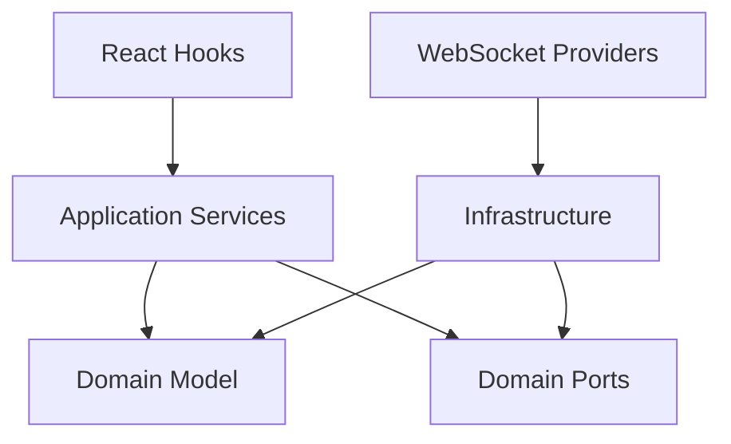

# EVM Integration Architecture Documentation

## Overview
This document defines the domain, system, and unit architecture for the CygnusWealth EVM Integration library. It serves as the authoritative reference for all DDD agents working on this system.

## Domain Architecture

### Bounded Context: EVM Integration
The EVM Integration bounded context is responsible for all read-only interactions with EVM-compatible blockchains. It provides portfolio aggregation, balance tracking, and transaction monitoring capabilities while maintaining strict client-side sovereignty.

### Domain Model

#### Core Aggregates

##### Portfolio Aggregate (Root)
- **Purpose**: Represents a wallet's complete portfolio on a specific blockchain
- **Location**: `src/domain/portfolio/Portfolio.ts`
- **Responsibilities**:
  - Manages collection of asset balances
  - Provides portfolio snapshots
  - Enforces invariants around balance updates
- **Key Methods**:
  - `updateBalance(asset, amount)`: Updates balance for specific asset
  - `getAllBalances()`: Returns non-zero balances
  - `snapshot()`: Creates immutable portfolio state

#### Value Objects

##### WalletAddress
- **Location**: `src/domain/blockchain/Address.ts`
- **Purpose**: Encapsulates and validates Ethereum addresses
- **Invariants**: Must be valid checksummed address
- **Factory**: `WalletAddress.from(string)`

##### EvmChain
- **Location**: `src/domain/blockchain/Chain.ts`
- **Purpose**: Represents supported EVM-compatible chains
- **Supported Chains**: Ethereum, Polygon, Arbitrum, Optimism, BSC, Avalanche
- **Factory**: `EvmChain.fromId(number)`

##### Balance
- **Location**: `src/domain/portfolio/Balance.ts`
- **Purpose**: Represents asset balance with proper decimal handling
- **Key Features**: 
  - Immutable
  - Handles BigInt arithmetic
  - Provides formatted output

### Domain Services

#### IEvmRepository (Port)
- **Location**: `src/domain/IEvmRepository.ts`
- **Purpose**: Defines contract for blockchain data access
- **Key Methods**:
  - `getPortfolio(address, chain)`: Fetches complete portfolio
  - `getNativeBalance(address, chain)`: Gets native token balance
  - `getTokenBalances(address, chain, tokens)`: Gets ERC20 balances
  - `subscribeToBalances(address, chain, callback)`: Real-time updates

### Domain Events
Currently not implemented but planned:
- `BalanceUpdatedEvent`
- `TokenDiscoveredEvent`
- `TransactionDetectedEvent`

## System Architecture

### Layered Architecture Pattern

```
┌─────────────────────────────────────────┐
│         Presentation Layer              │
│  (React Hooks & Components)             │
├─────────────────────────────────────────┤
│        Application Layer                │
│    (Services & Use Cases)               │
├─────────────────────────────────────────┤
│          Domain Layer                   │
│   (Entities, VOs, Aggregates)          │
├─────────────────────────────────────────┤
│       Infrastructure Layer              │
│  (Repositories, External Services)      │
└─────────────────────────────────────────┘
```

### Layer Responsibilities

#### Presentation Layer (`src/hooks/`, `src/providers/`)
- React hooks for UI integration
- WebSocket providers for real-time data
- Maintains backward compatibility with wagmi-based hooks
- New DDD-aligned hooks (`usePortfolio`)

#### Application Layer (`src/application/`)
- **PortfolioService**: Orchestrates domain operations
- Handles cross-cutting concerns
- Validates inputs and manages errors
- Provides simplified API for presentation layer

#### Domain Layer (`src/domain/`)
- Pure business logic
- No framework dependencies
- Defines core types and interfaces
- Enforces business rules and invariants

#### Infrastructure Layer (`src/infrastructure/`)
- **EvmRepository**: Viem-based blockchain access
- **ConfigurationService**: Environment management
- Handles external integrations
- Implements domain interfaces

### Module Dependencies



### External Dependencies
- **wagmi**: Legacy hook compatibility
- **viem**: Low-level blockchain interactions
- **ethers**: Additional utilities
- **@cygnus-wealth/data-models**: Shared type definitions

## Unit Architecture

### Component Design Patterns

#### Repository Pattern Implementation
```typescript
// Port (Domain Interface)
interface IEvmRepository {
  getPortfolio(address: WalletAddress, chain: EvmChain): Promise<Portfolio>
}

// Adapter (Infrastructure Implementation)
class EvmRepository implements IEvmRepository {
  constructor(private config: ConfigurationService) {}
  // Implementation using viem
}
```

#### Service Layer Pattern
```typescript
class PortfolioService {
  constructor(private repository: IEvmRepository) {}
  
  async getPortfolio(address: string, chainId: number): Promise<Portfolio> {
    // Validation
    const walletAddress = WalletAddress.from(address);
    const chain = EvmChain.fromId(chainId);
    
    // Delegation to repository
    return this.repository.getPortfolio(walletAddress, chain);
  }
}
```

#### Factory Pattern for Value Objects
```typescript
class WalletAddress {
  private constructor(private value: Address) {}
  
  static from(address: string): WalletAddress {
    // Validation and creation
  }
}
```

### Hook Architecture

#### Legacy Hooks (Backward Compatibility)
- Direct wagmi integration
- Minimal abstraction
- Returns data-models types

#### New DDD Hooks
- Use domain services
- Return domain models
- Provide richer functionality

### Configuration Architecture

#### Singleton Pattern
```typescript
class ConfigurationService {
  private static instance: ConfigurationService;
  
  static getInstance(overrides?: Partial<Config>): ConfigurationService {
    // Singleton implementation
  }
}
```

#### Environment Management
- Supports environment variables
- Provides sensible defaults
- Allows runtime overrides

### Error Handling Architecture

#### Domain Errors
```typescript
class InvalidAddressError extends Error
class UnsupportedChainError extends Error
class RepositoryError extends Error
```

#### Error Propagation
1. Infrastructure catches low-level errors
2. Wraps in domain-specific errors
3. Application layer handles gracefully
4. Presentation shows user-friendly messages

### Testing Architecture

#### Unit Tests
- Domain logic tested independently
- Value objects have property-based tests
- Services use test doubles

#### Integration Tests
- Repository tests with mock clients
- Service tests with real domain objects
- Hook tests with React Testing Library

#### E2E Tests
- WebSocket connection scenarios
- Real blockchain interaction tests
- Multi-chain portfolio aggregation

## Security Considerations

### Read-Only Operations
- No private key handling
- No transaction signing
- Pure data aggregation

### Client-Side Execution
- All operations in browser
- No server dependencies
- Local caching only

### Input Validation
- Address validation in value objects
- Chain ID verification
- Amount bounds checking

## Performance Optimizations

### Caching Strategy
- Not yet implemented
- Planned: IndexedDB for persistent cache
- In-memory caching for session

### Polling Configuration
- Configurable intervals (default 15s)
- WebSocket preferred over polling
- Automatic fallback to HTTP

### Bundle Size
- Tree-shakeable exports
- Lazy loading for heavy dependencies
- Modular architecture enables code splitting

## Future Enhancements

### Planned Domain Enhancements
1. **Domain Events**: Implement event sourcing
2. **Saga Pattern**: Complex multi-chain operations
3. **Specification Pattern**: Complex query building

### Planned Infrastructure Enhancements
1. **Multi-Provider Support**: Failover between RPC providers
2. **Caching Layer**: IndexedDB persistence
3. **Rate Limiting**: Protect against excessive RPC calls

### Planned Application Enhancements
1. **CQRS Implementation**: Separate read/write models
2. **Query Optimization**: Batch and multicall
3. **Subscription Management**: Efficient real-time updates

## Migration Guide

### Adopting New Architecture
1. Continue using existing hooks (no breaking changes)
2. Gradually adopt `usePortfolio` for new features
3. Use domain services for complex operations
4. Leverage type safety with branded types

### Example Migration
```typescript
// Old approach
import { useEvmBalance } from '@cygnus-wealth/evm-integration';

const { balance } = useEvmBalance({ address, chainId });

// New approach
import { usePortfolio } from '@cygnus-wealth/evm-integration';

const { portfolio } = usePortfolio({ address, chainId });
const nativeBalance = portfolio?.getNativeBalance();
```

## Agent Guidelines

### For ddd-unit-architect
- Reference value object patterns in `src/domain/`
- Follow factory pattern for object creation
- Ensure immutability in domain objects
- Design rich domain models with behavior

### For ddd-software-engineer
- Implement using established patterns above
- Follow testing architecture guidelines
- Use dependency injection via constructor
- Maintain backward compatibility

### For ddd-system-architect
- Consider layer boundaries when designing
- Ensure proper dependency flow (inward only)
- Design for testability and maintainability
- Plan for WebSocket-first, HTTP fallback

### For ddd-domain-architect
- Maintain bounded context integrity
- Design aggregates around consistency boundaries
- Define clear domain events
- Establish ubiquitous language

### For ddd-enterprise-architect
- Ensure alignment with CygnusWealth vision
- Maintain decentralization principles
- Consider cross-chain implications
- Plan for multi-repository architecture

## Conventions and Standards

### Naming Conventions
- Value Objects: Noun (e.g., `WalletAddress`)
- Services: Noun + "Service" (e.g., `PortfolioService`)
- Repositories: Noun + "Repository" (e.g., `EvmRepository`)
- Factories: Static `from` or `create` methods

### File Organization
```
src/
├── domain/           # Pure domain logic
│   ├── blockchain/   # Blockchain-specific VOs
│   ├── portfolio/    # Portfolio aggregate
│   └── types/        # Branded types
├── application/      # Use cases and services
├── infrastructure/   # External integrations
└── hooks/           # React integration
```

### Code Style
- Immutable by default
- Explicit error handling
- Comprehensive JSDoc comments
- Type-safe throughout

## Glossary

- **Aggregate**: Cluster of domain objects treated as a unit
- **Value Object**: Immutable object defined by its attributes
- **Repository**: Abstraction for data access
- **Service**: Stateless operation coordinator
- **Port**: Domain interface defining requirements
- **Adapter**: Infrastructure implementation of port
- **Branded Type**: Nominal type for compile-time safety

## References

- [Domain-Driven Design by Eric Evans](https://www.domainlanguage.com/ddd/)
- [Implementing Domain-Driven Design by Vaughn Vernon](https://www.informit.com/store/implementing-domain-driven-design-9780321834577)
- [Clean Architecture by Robert Martin](https://blog.cleancoder.com/uncle-bob/2012/08/13/the-clean-architecture.html)
- [Hexagonal Architecture by Alistair Cockburn](https://alistair.cockburn.us/hexagonal-architecture/)